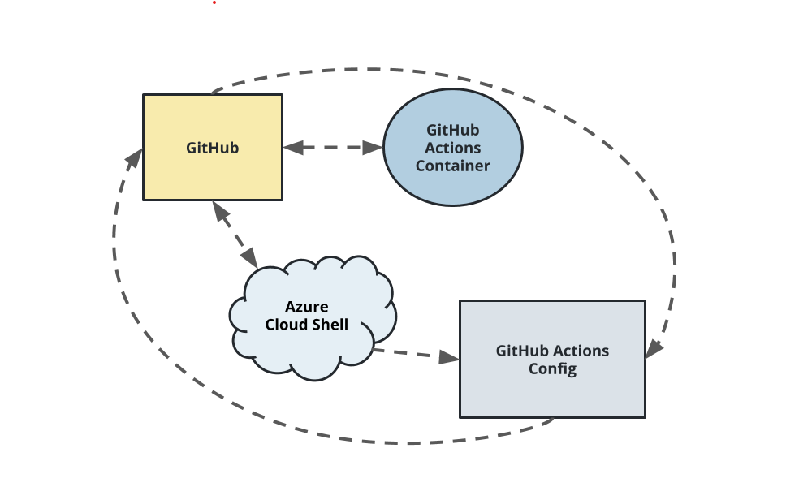
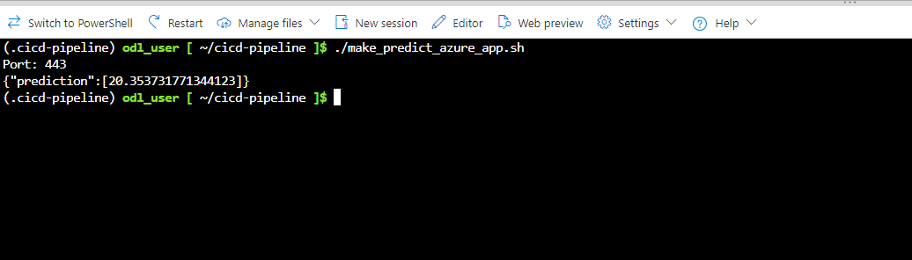
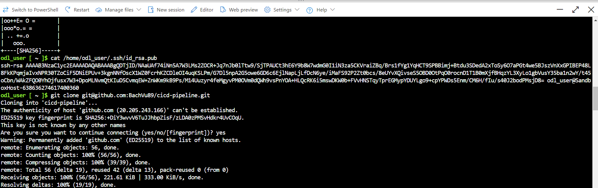
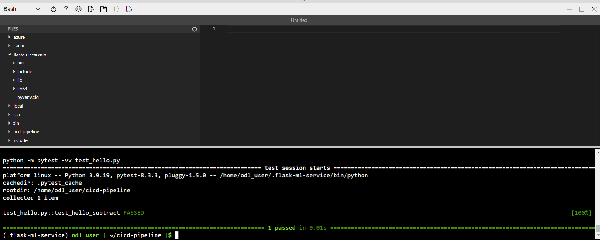
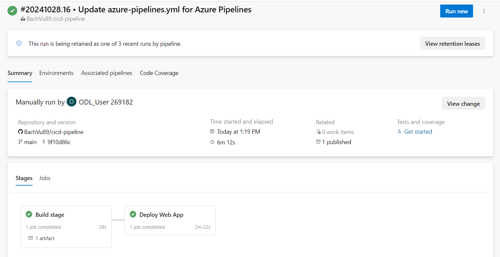

# Overview

This project help you to know about deploy on azure , build CI/CD pipeline , test API app service , cloud shell.
 ![alt text][Badge]

## Project Plan
<TODO: Project Plan

* A link to a Trello board for the project
https://trello.com/invite/b/66ffa632decaab12b68420dd/ATTI33b7438a33a1b5a78fa89d7f219171daF463D6C8/azure-devops-project-management
* A link to a spreadsheet that includes the original and final project plan>
https://docs.google.com/spreadsheets/d/1v8YW58UcrGgWk1LJFVf2BQpbQ8MNIyjkWhs4Dx0aGq0/edit?usp=sharing


## Instructions

<TODO:  
* Architectural Diagram (Shows how key parts of the system work)>



<TODO:  Instructions for running the Python project.  How could a user with no context run this project without asking you for any help.  Include screenshots with explicit steps to create that work. Be sure to at least include the following screenshots:

* Project running on Azure App Service
In order to run on Azure App service we clone the repo,navigate to the repo and after that we run `make setup`, then run 
`source .cicd-pipeline/bin/activate` , after that run `make install` to install requirements for python.

- Deploy app with Azure App Service  run : ` az webapp up -n udacity2 --resource-group Azuredevops --location eastus2`, result test with Azure App Service:



* Project cloned into Azure Cloud Shell
create ssh key: 
`ssh-keygen -t rsa.`

after key is generated we get it in ./ssh folder 
 enter till it done generate
cd ./ssh => get public key by using `cat id_rsa.pub`
copy and paste it into github account.
after done added ssh key into github account 
you easily to clone it self:


* Passing tests that are displayed after running the `make all` command from the `Makefile`:


* Output of a test run
Enable git hub action by create a folder .github/workflows at a root level. then create a yaml file (pythonapp.yaml by default):


* Running Azure App Service from Azure Pipelines automatic deployment

* Successful prediction from deployed flask app in Azure Cloud Shell.  [Use this file as a template for the deployed prediction](https://github.com/udacity/nd082-Azure-Cloud-DevOps-Starter-Code/blob/master/C2-AgileDevelopmentwithAzure/project/starter_files/flask-sklearn/make_predict_azure_app.sh).
The output should look similar to this:


```bash
udacity@Azure:~$ ./make_predict_azure_app.sh
Port: 443
{"prediction":[20.353731771344123]}
```


## Enhancements

<TODO: A short description of how to improve the project in the future>

Change with different multi languages not only Python

## Demo 

<TODO: Add link Screencast on YouTube>

https://youtu.be/Xbj_3Sku55E

[Badge]: https://github.com/BachVu89/cicd-pipeline/actions/workflows/pythonapp.yml/badge.svg
